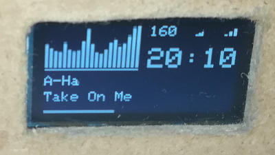

# Moode, Volumio, RuneAudio and MPD OLED Spectrum Display for Raspberry Pi

The mpd_oled program displays an information screen including a music
frequency spectrum on an OLED screen connected to a Raspberry Pi (or similar)
running MPD, this includes Moode, Volumio and rAudio (RuneAudio fork).
The program supports I2C and SPI 128x64 OLED displays with an SSD1306,
SSD1309, SH1106 or SSH1106 controller.


## Install

A binary installation package is provided for Moode, Volumio and rAudio,
and is the quickest and easiest way to install mpd_oled on these systems.
All other systems should install from source code (Note: the build
commands take a long time to run on a Pi Zero).

### Moode

* [Install mpd_oled binary package on Moode 7](doc/install_moode7_deb.md)
* [Install mpd_oled binary package on Moode 6](doc/install_moode6_deb.md)
* [Install mpd_oled from source on Moode 7](doc/install_moode7_source.md)
* [Install mpd_oled from source on Moode 6](doc/install_moode6_source.md)

### Volumio

* [Install mpd_oled binary package on Volumio 2](doc/install_volumio2_deb.md)
* [Install mpd_oled from source on Volumio 2](doc/install_volumio2_source.md)

Another alternative is
[Mase's mpd_oled plugin for Volumio](https://github.com/supercrab/volumio-plugins/tree/master/plugins/miscellanea/mpd_oled)
(external project). The plugin installs mpd_oled and allows
it to be configured through the Volumio UI.

### rAudio

* [Install mpd_oled from source on rAudio 1](doc/install_raudio1.md)

A binary package is provided for the Pi Zero only

* [Install mpd_oled binary package for Pi Zero on rAudio 1](doc/install_raudio1_zst.md)

### Other OS

* Debian-based OS running MPD: follow the instructions to
  [Install mpd_oled from source on Volumio 2](doc/install_volumio2_source.md)
  but configure a copy of the audio by editing /etc/mpd.conf directly and
  appending the contents of `/usr/local/share/mp_oled/mpd_oled_fifo.conf`.
* Arch-based OS running MPD: follow the instructions to
  [Install mpd_oled from source on rAudio 1](doc/install_raudio1_source.md)
  but configure a copy of the audio by editing /etc/mpd.conf directly and
  appending the contents of `/usr/local/share/mp_oled/mpd_oled_fifo.conf`.


## Program Help and Options

The following text is printed by running `mpd_oled -h`
```
Usage: mpd_oled -o oled_type [options] [input_file]

Display information about an MPD-based player on an OLED screen

Options
  -h,--help this help message
  --version version information
  -o <type>  OLED type, specified as a number, from the following:
      1 Adafruit SPI 128x64
      3 Adafruit I2C 128x64
      4 Seeed I2C 128x64
      6 SH1106 I2C 128x64
      7 SH1106 SPI 128x64
  -b <num>   number of bars to display (default: 16)
  -g <sz>    gap between bars in, pixels (default: 1)
  -f <hz>    framerate in Hz (default: 15)
  -s <vals>  scroll rate (pixels per second) and start delay (seconds), up
             to four comma separated decimal values (default: 8.0,5.0) as:
                rate_all
                rate_all,delay_all
                rate_title,delay_all,rate_artist
                rate_title,delay_title,rate_artist,delay_artist
  -C <fmt>   clock format: 0 - 24h leading 0 (default), 1 - 24h no leading 0,
                2 - 24h leading 0, 3 - 24h no leading 0
  -d         use USA date format MM-DD-YYYY (default: DD-MM-YYYY)
  -P <val>   pause screen type: p - play (default), s - stop
  -k         cava executable name is cava (default: mpd_oled_cava)
  -c         cava input method and source (default: 'fifo,/tmp/mpd_oled_fifo')
             e.g. 'fifo,/tmp/my_fifo', 'alsa,hw:5,0', 'pulse'
  -R         rotate display 180 degrees
  -I <val>   invert black/white: n - normal (default), i - invert,
             number - switch between n and i with this period (hours), which
             may help avoid screen burn
  -a <addr>  I2C address, in hex (default: default for OLED type)
  -B num     I2C bus number (default: 1, giving device /dev/i2c-1)
  -r <gpio>  I2C/SPI reset GPIO number, if needed (default: 25)
  -D <gpio>  SPI DC GPIO number (default: 24)
  -S <num>   SPI CS number (default: 0)
  -p <plyr>  Player: mpd, moode, volumio, runeaudio (default: detected)
Example :
mpd_oled -o 6 use a SH1106 I2C 128x64 OLED
```

Please check the [FAQ](doc/FAQ.md)

## Credits

C.A.V.A. is a bar spectrum audio visualizer: <https://github.com/karlstav/cava>

OLED interface based on ArduiPI_OLED: <https://github.com/hallard/ArduiPi_OLED>
(which is based on the Adafruit_SSD1306, Adafruit_GFX, and bcm2835 library
code).

C library for Broadcom BCM 2835: <https://www.airspayce.com/mikem/bcm2835/>
